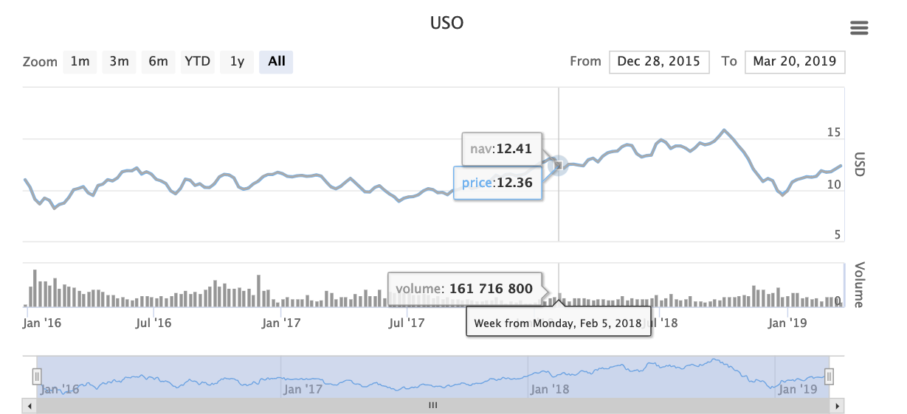
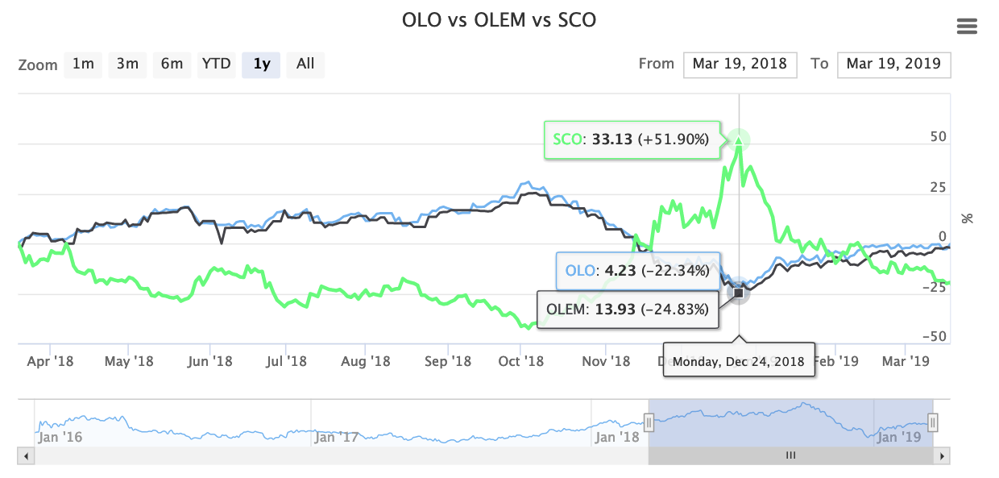
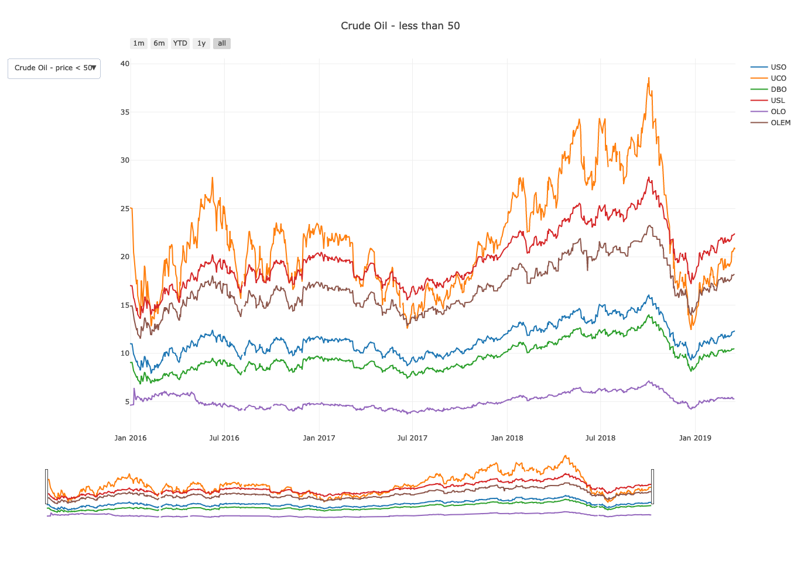
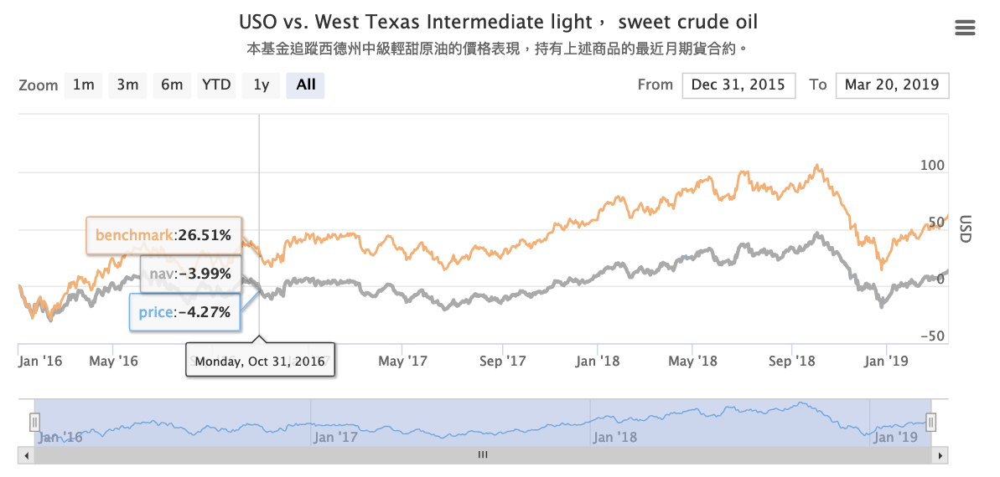
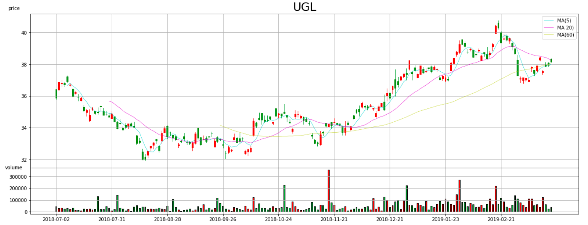

# HW1_ETF爬蟲與資料視覺化

---

## Part I 爬蟲


HW1使用的爬蟲套件為`requests`及`Beautifulsoup`。  
### 選則套件原因 - 
- `requests` - 透過https使用restful-api做get與post時，user的query都需要經過header的認證來確保送來的query有效的，而`requests`套件即幫忙我們做了這件事。 
- `Beautifulsoup` - parse html常見的套件，`Beautifulsoup`能幫我們取出html中我們想要選取的部分，將其直接轉換成我們要的資料格式。

---

### 流程圖 - 


--- 
### 5種當別人使用你的程式最有可能會遇到的錯誤情況 - 
1.  大小寫輸入錯誤
    - 情況描述：使用者可能會輸入不同的大小寫，如`GLd`，將導致混亂與錯誤
    - 解決辦法：使用`upper()`統ㄧ將使用者輸入的ETF文字轉為大寫
2.  日期輸入錯誤
    - 情況描述：使用者可能會輸入錯誤的日期，如`2018-02-31`，將導致錯誤
    - 解決辦法：使用`try` `except`，在發生error時判定該日期不存在
3.  該ETF以下市
    - 情況描述：在本組的ETF名單中，2015年年底前既已存在但已下市的ETF有`UWTI`與`DWTI`，在財經網站上無法搜尋到該ETF，將導致錯誤
    - 解決辦法：使用`try` `except`，在發生error時判定該ETF已下市
4.  變數未定義
    - 情況描述：除了爬蟲程式，另有`etf_plot`繪圖程式，該函式會呼叫`scrape`進行爬蟲並定義全域變數`need_plot`為`True`通知`scrape`爬取價格、交易量與淨值。在尚未執行`etf_plot`前就執行`scrape`的話，未定義變數`need_plot`將導致錯誤
    - 解決辦法：使用`try` `except`，在發生error時判定尚未執行`etf_plot`
5.  爬蟲目標輸入錯誤
    - 情況描述：函式`scrape`可爬取淨值或價格，故在argument`target`中可以輸入`price`或`nav`兩種選項，使用者輸入其他指令將導致錯誤
    - 解決辦法：使用if與else判斷式，若輸入`price`與`nav`以外指令將回傳指引訊息

### 爬蟲程式使用說明 - 
- `scrape(etf, target, startdate, enddate)`  

| argument | 描述 |
| :-: | :-: |
| etf | 要爬取的ETF名稱，型態為字串 |
| target | 可輸入price與nav爬取相對應的資料 |
| startdate | 請輸入yyyy-mm-dd的字串格式 |
| enddate | default為現在時間，不輸入不影響運作 |

- 範例程式
```python
    scrape('GLD', 'nav', '2015-12-31').head()
```
`output`
|  | GLD |
| :-: | :-: |
| 2015-12-31 | 101.6247 |
| 2016-01-04 | 103.5343 |
| 2016-01-05 | 103.0307 |
| 2016-01-06 | 104.4077 |
| 2016-01-07 | 105.8368 |

- 備註  
爬蟲程式以[MoneyDJ](https://www.moneydj.com/)為爬取對象，之所以不採用各ETF之homepage原因為：
    - 在本組的ETF名單中，除已下市ETF外，至少有3檔ETF(DTO, DGP, DGLD)的官網連結失效
    - 將來需大量爬取ETF或即時更新ETF資訊時，為每檔ETF撰寫不同的爬蟲程式可能較無效率
    - 除ETF價格外，MoneyDJ另有淨值(nav)資訊，可根據自身需求調整目標資料

--- 

## Part II 資料視覺化

- 單ㄧETF日資料呈現，包含`價格` `淨值` `成交量`
```python
    etf_plot('USO', '2015-12-31')
```
`output`



- 隨機取3檔ETF比較



- 所有ETF比較，使用`Plotly`建立下拉式選單，可以選擇觀看不同類別(黃金、原油)的ETF



- ETF與其追蹤指數比較

>ETF以追求較其追蹤指數高的報酬為目標，而商品型ETF通常以商品期貨為追蹤標的，  
長期下來會因正價差(contango)遭受轉倉成本的損失，故通常長期表現會較其追蹤指數差，產生追蹤誤差(tracking error)。  
若以長期持有為目的，應選定能穩定貼近其追蹤指數的ETF。

視覺化比較ETF與其追蹤指數，了解該ETF在選定期間內是否能打敗其追蹤指數
```python
performance('USO', '2015-12-31')
```
`output`



-  單ㄧETF技術分析

```python
technical_analysis('UGL', '2018-07-01')
```
`output`

