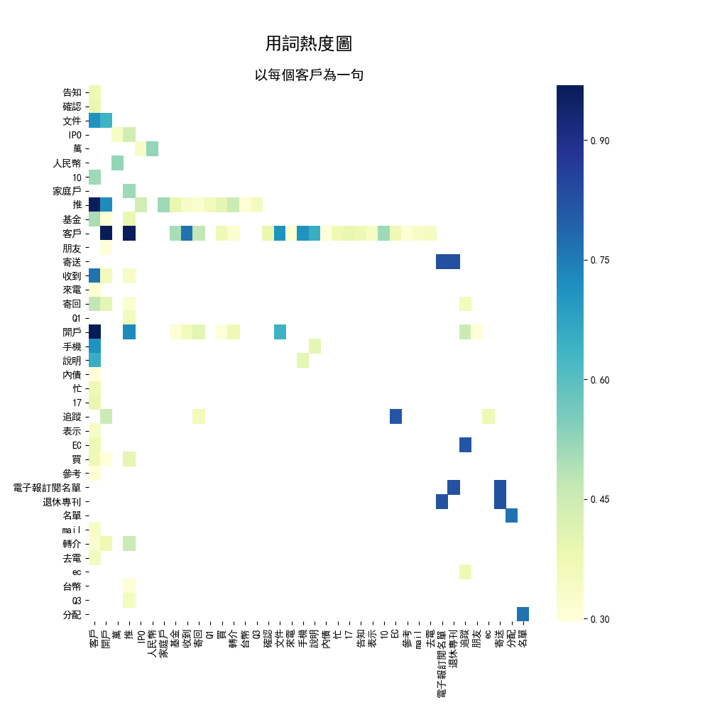

# HW2_資料收集與文字探勘共現性進行資料視覺化

---

## Part I Name Entity Recognition

以[A simple BiLSTM-CRF model for Chinese Named Entity Recognition](https://github.com/Determined22/zh-NER-TF)進行進行NER的詞性標記，將初步整理過格式的客服資料作為輸入資料。

  
### 標記分析 - 
- `範例資料` - 該 [Github](https://github.com/Determined22/zh-NER-TF) 所提供的test set資料相當準確，確實將每句話中的Entity標記出來。
- `客服資料` - 標記結果不是非常樂觀，常標記到一些不重要的詞, ex: 來電說。 原因可能有以下兩個: 
    >1.該篇文章很多內容皆是以簡寫表示，如上述的"來電說"。

    >2.可能該model是以中國的簡體字詞進行訓練, 在分析上中國簡體字用詞與台灣繁體用詞有相當差異。

--- 

## Part II 資料視覺化:

- TDM (Term-document matrix) : 
    >1.用詞熱度圖 - 以每筆通聯紀錄為一句
    

    >2.用詞熱度圖 - 以每個客戶為一句
    

- Co-Occurence Matrix
    >1.用詞共線圖 - 以每筆通聯紀錄為一句
    

    >2.用詞共線圖 - 以每個客戶為一句
    

- Callout 次數分佈圖
    > Callout次數/unique ID
    

- 分析：
    >1.從共線圖中可以發現當客服使用"推"以及"買"這兩個詞彙時通常與"客戶"有高度相關，且高度的可能性進行基金/人民幣的相關議題

    >2.在callout次數中,可以明顯看出來對於特定的ID去來電的次數非常高, 在前三名中各有350,123與50次，可猜測為上述用戶有非常高的頻率在進行交易。

