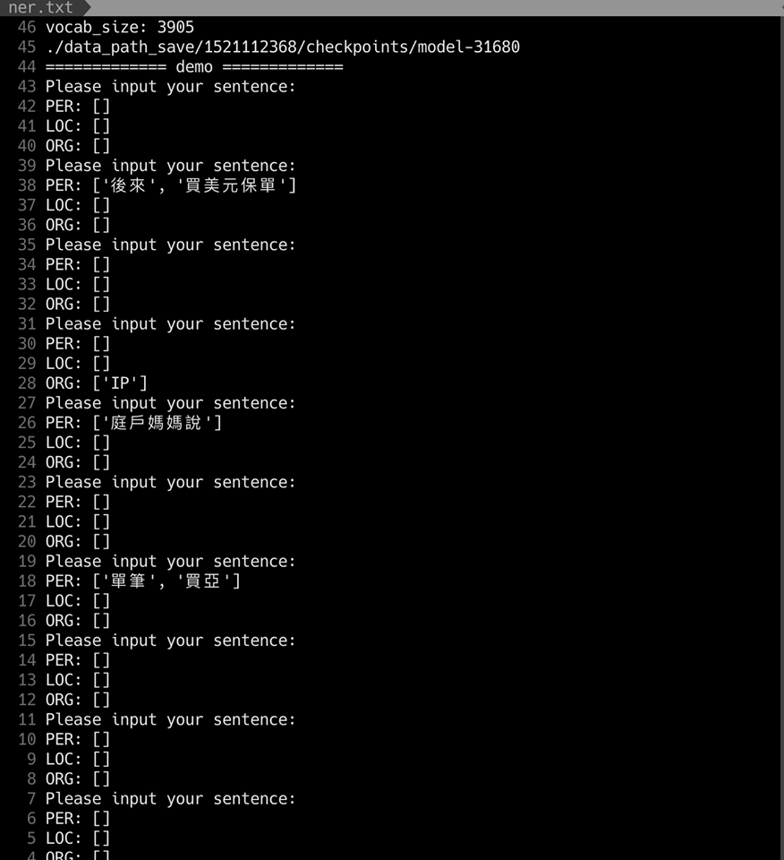
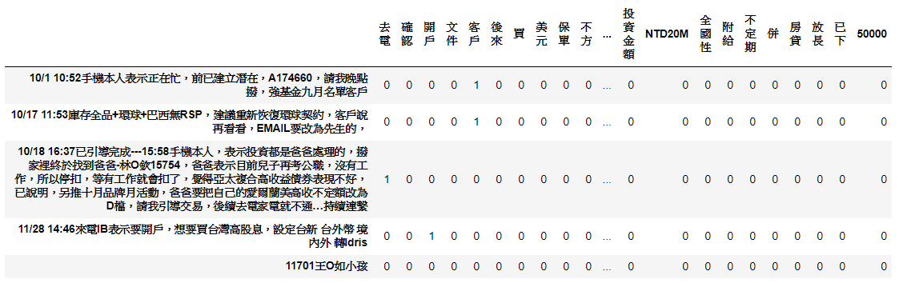
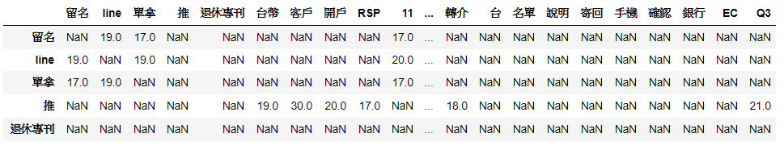
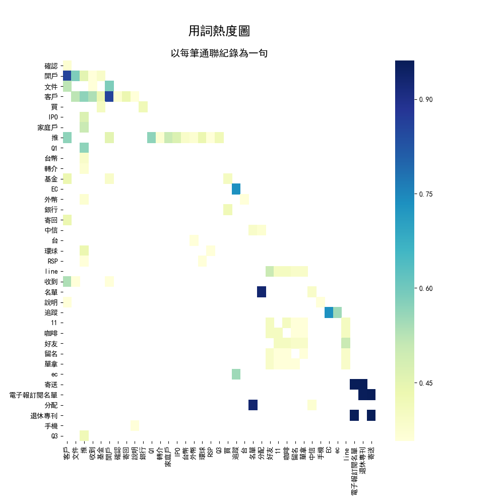

# HW2_資料收集與文字探勘共現性進行資料視覺化
文字探勘淘金：從客服聯繫紀錄找出淺在銷售機會  

---

## Part I 針對自訂議題收集相關文本


### 資料來源 - 
- **野村證券**所提供之NTU深耕客服資料檔  
--- 

## Part II 將收集到的文本用NER挑選出  

### 使用套件 -   
- `jieba` - 中文斷詞(分詞)套件。

安裝套件

```
pip3 install jieba
```

### 利用jieba分詞 -   
以下簡易列出5筆。  

| **原始對話紀錄** | **分詞後結果** |
| :-------------: |:-------------:|
| 客戶事件描述 | 客戶/ 事件/ 描述 |
| 去電確認開戶文件客戶說後來去買美元保單就不開戶了 | 去/ 電/ 確認/ 開戶/ 文件/ 客戶/ 說/ 後/ 來/ 去/ 買/ 美元/ 保單/ 就/ 不/ 開戶/ 了  |
| 不方說IPOMAIL | 不方說/ IPO/ MAIL |
| IPO忙先MAIL | IPO/ 忙/ 先/ MAIL |
| 家庭戶媽媽說女兒不開了，因為打工收入不穩定 | 家庭/ 戶/ 媽媽/ 說/ 女兒/ 不開/ 了/ ，/ 因為/ 打工/ 收入/ 不/ 穩定 |

### 計算分詞出現頻率 -   
以下簡易列出前10筆。  

| **term** | **score** |
| :-------------: |:-------------:|
| money | 46.107700 |
| 開戶 | 35.857617 |
| 客戶 | 33.526101 |
| 名單 | 32.948703 |
| ec | 32.943381 |
| 專刊 | 30.181565 |
| 分配 | 29.649564 |
| ipo | 28.954837 |
| 退休 | 27.301790 |
| 電子 | 23.492975 |

### 經過 NER Model 挑選之結果-   
NER Model：[A simple BiLSTM-CRF model for Chinese Named Entity Recognition](https://github.com/Determined22/zh-NER-TF) 



--- 

## Part III 將文件與有分類過的單詞進行TDM
使對話紀錄與分詞結果成為一個稀疏矩陣。  



--- 

## Part IV 將TDM轉成Co-Occurrence Matrix
從Co-Occurrence Matrix中可觀察得知分詞與分詞之間相互關聯的程度。



--- 

## Part V 繪製出各類別之間的共現圖

### 共現圖 -  


### 熱度圖 -  

